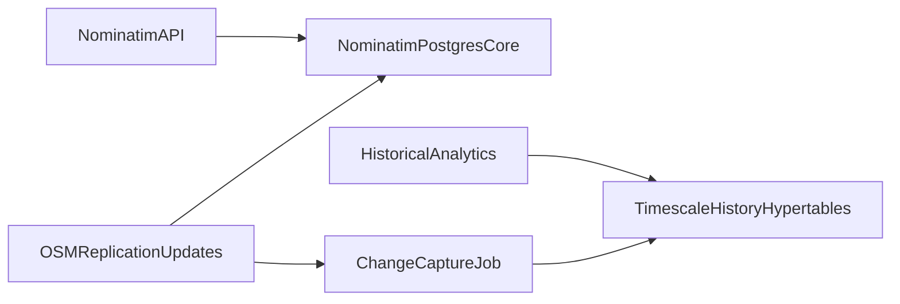

# TimescaleDB for Nominatim History

## Recommendation
- Do not replace Nominatim's core PostgreSQL schema/tables with Timescale hypertables.
- Use TimescaleDB only as a separate historical/analytics layer (append-only change history, metrics, query logs), not for the live geocoding index.

## Why
- Nominatim is optimized for current-state geocoding with heavy relational indexes and frequent in-place update logic; this does not map cleanly to hypertable design.
- Timescale compression targets chunked time-series hypertables and is strongest for append-heavy, time-partitioned data.
- For core Nominatim data, expected risk is high (schema/tooling incompatibility, migration complexity, uncertain query benefits).

## Practical architecture

## Scope in this repository
- Keep `docker-compose.yml` and `docker-compose.pg18.yml` on standard Nominatim PostgreSQL for serving.
- If historical retention is required, add a separate DB/service profile for Timescale with ETL from replication diffs or DB logical decoding.
- Keep import options (`IMPORT_WIKIPEDIA`, postcode datasets) in Nominatim core as they are unrelated to Timescale compression.

## Validation criteria
- No regression in `/search`, `/reverse`, `/status` latency on Nominatim core.
- Measurable storage reduction for history tables after compression.
- Historical queries (trend/audit) run against Timescale only, isolated from serving path.
